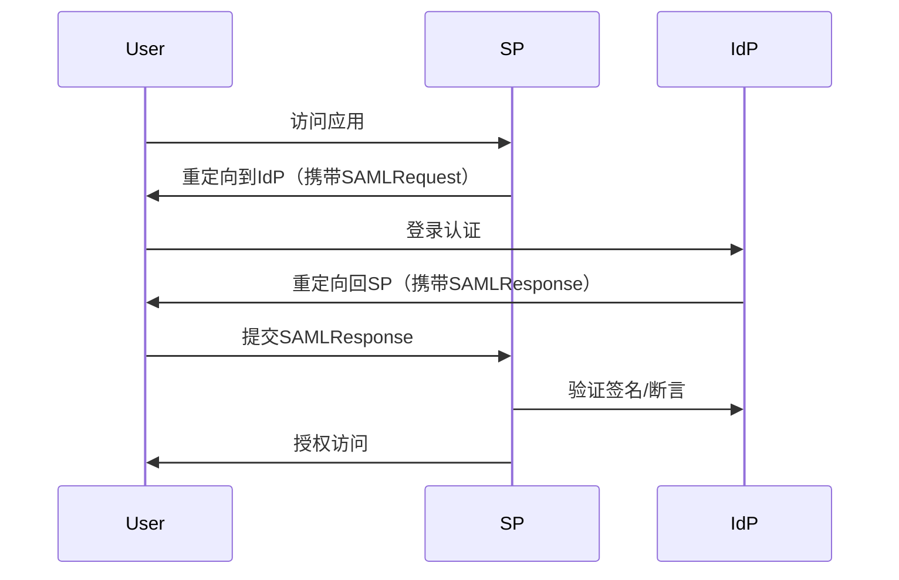

# SAML

## Overview
### 1. **SAML 是什么？**
- **全称**：Security Assertion Markup Language（安全断言标记语言）
- **本质**：基于 XML 的开放标准，用于在**身份提供者（IdP）**和**服务提供者（SP）**之间交换认证和授权数据。
- **核心目标**：实现**跨域单点登录（SSO）**，用户登录一次即可访问多个互信系统。

---

### 2. **关键概念**
- **断言（Assertion）**：IdP 生成的 XML 格式凭证，包含用户身份信息（如用户名、属性、权限）。
  - 三种类型：
    - **认证断言**：证明用户已登录。
    - **属性断言**：传递用户属性（如邮箱、部门）。
    - **授权断言**：声明用户是否有权限访问资源。
- **角色**：
  - **Identity Provider (IdP)**：负责认证用户并生成断言（如公司LDAP、Azure AD）。
  - **Service Provider (SP)**：依赖 IdP 的断言授权用户访问资源（如SaaS应用）。
- **协议流程**：典型的浏览器重定向流程（如SP发起SSO请求 → IdP返回SAML响应）。

---

### 3. **SAML 的核心协议**
- **SAML 1.x/2.0**：主流版本是 SAML 2.0（2005年发布），支持更复杂的场景（如注销、元数据交换）。
- **绑定（Bindings）**：定义如何传输SAML消息：
  - **HTTP Redirect/POST**：最常见（通过浏览器传递SAML数据）。
  - **SOAP**：用于后端通信（如属性查询）。
- **元数据（Metadata）**：XML文件描述IdP/SP的配置（如证书、端点URL），用于自动配置信任关系。

---

### 4. **SAML 的工作流程（Web SSO 示例）**

---

### 5. **相关协议对比**
| 协议       | 场景                | 数据格式 | 传输方式          | 特点                     |
|------------|---------------------|----------|-------------------|--------------------------|
| **SAML**   | 企业SSO、跨域       | XML      | HTTP Redirect/POST| 复杂但功能全，适合企业   |
| **OAuth2** | API授权、移动端     | JSON     | HTTP/RESTful      | 轻量，适合现代应用       |
| **OpenID Connect** | 社交登录    | JSON     | HTTP              | 基于OAuth2，扩展身份层   |

---

### 6. **开发者需要关注什么？**
- **SP 集成**：
  - 使用库（如Python的`python3-saml`、Java的`OpenSAML`）。
  - 解析SAMLResponse，验证签名和断言时效性。
- **安全**：
  - 必须启用**签名/加密**（防止篡改）。
  - 防范**重放攻击**（检查`InResponseTo`和断言时间戳）。
- **调试工具**：
  - 浏览器插件（如"SAML Tracer"查看请求/响应）。
  - 在线解码工具（解码Base64编码的SAML消息）。

---

### 7. **典型应用场景**
- 企业内部系统集成（如HR系统 + 邮箱 + 内部Wiki）。
- 云服务SSO（如Salesforce、Workday通过企业AD登录）。

# Reference
* [how-saml-authentication-works](https://goteleport.com/blog/how-saml-authentication-works)

* [SAML Blog](https://blog.samlsecurity.com/p/opensaml.html)

* [SAML RFC7522](https://datatracker.ietf.org/doc/html/rfc7522)

* [SAML Specification](http://saml.xml.org/saml-specifications)
