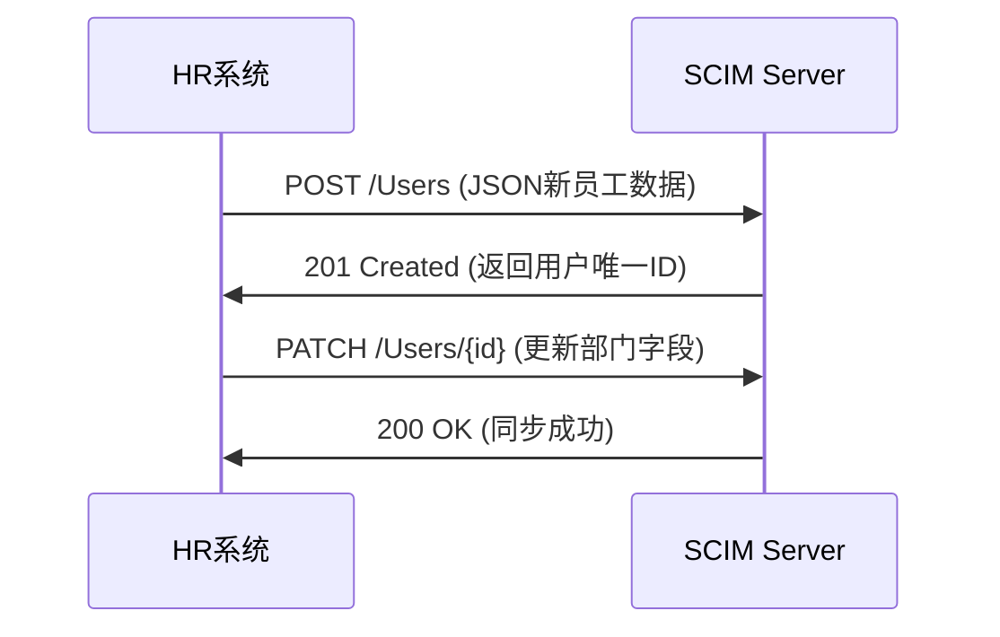

# SCIM

## Overview


### 1. **SCIM 是什么？**
- **全称**：System for Cross-domain Identity Management（跨域身份管理系统）
- **本质**：基于 RESTful API 的开放标准，用于在不同系统之间**自动化同步用户身份数据**（如创建/更新/删除用户账号）。
- **核心目标**：解决企业多系统间的**用户生命周期管理**问题，替代手动操作或定制化脚本。

---

### 2. **关键概念**
- **标准化架构**：
  - **Schema**：预定义的用户（`User`）和组（`Group`）数据模型（如用户名、邮箱、部门等字段）。
  - **协议**：通过 HTTP（通常为 REST + JSON）实现 CRUD 操作（如 `POST /Users` 创建用户）。
- **角色**：
  - **客户端（Client）**：发起同步请求的系统（如HR系统、IdP）。
  - **服务端（Server）**：接收并处理请求的目标系统（如SaaS应用、目录服务）。
- **核心操作**：
  - **用户/组管理**：增删改查、批量操作。
  - **变更推送（Push）或拉取（Pull）**：支持主动推送或定时同步。

---

### 3. **SCIM 协议版本**
- **SCIM 1.1**：早期版本，功能较基础。
- **SCIM 2.0**（主流版本）：
  - 完善了数据模型和扩展机制。
  - 支持 OAuth 2.0 鉴权、更灵活的属性映射。

---

### 4. **SCIM 核心工作流程**


---

### 5. **SCIM 数据模型示例（JSON）**
```json
// 用户资源示例
{
  "schemas": ["urn:ietf:params:scim:schemas:core:2.0:User"],
  "id": "001",
  "userName": "zhangsan",
  "name": { "givenName": "三", "familyName": "张" },
  "emails": [{ "value": "zhangsan@example.com", "primary": true }],
  "active": true,
  "groups": [{ "value": "dev" }]
}
```

---

### 6. **相关协议对比**
| 协议          | 场景                   | 数据格式 | 特点                          |
|---------------|------------------------|----------|-------------------------------|
| **SCIM**      | 用户属性同步           | JSON     | 标准化字段，适合自动化运维    |
| **LDAP**      | 目录服务查询/认证      | 二进制   | 高性能，适合企业内部目录     |
| **SAML JIT**  | 按需创建用户（SSO时）  | XML      | 依赖SSO流程，无完整生命周期管理 |
| **Proprietary API** | 定制化同步    | 任意     | 灵活但维护成本高              |

---

### 7. **开发者需要关注什么？**
- **集成场景**：
  - 将企业HR系统与云服务（如Okta、Azure AD）同步。
  - 内部系统间的账号自动开通/禁用。
- **安全**：
  - 必须使用 HTTPS + OAuth2.0 鉴权。
  - 敏感字段（如密码）需加密传输。
- **调试工具**：
  - **Postman**：手动测试 SCIM API。
  - **SCIM 兼容性测试工具**（如SPRYTE的验证工具）。

---

### 8. **典型应用场景**
- **员工入职/离职**：HR系统触发SCIM操作，自动开通或禁用所有相关系统账号。
- **多云环境**：在AWS、GitHub、Slack等平台间同步用户组信息。

