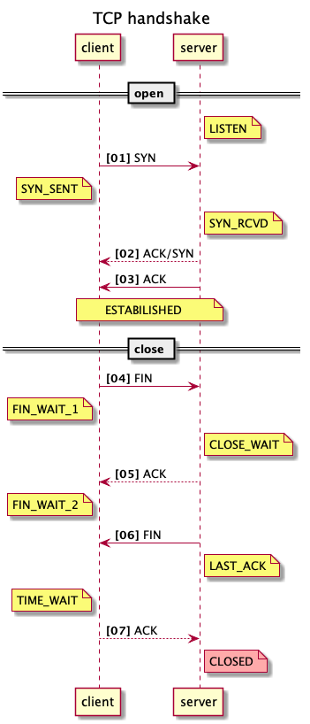

# TLS (Transport Layer Security)

## TCP flow


```
title TCP handshake
participant client
participant server
autonumber "<b>[00]"

== open ==
note right of server: LISTEN
client -> server: SYN
note left of client: SYN_SENT
note right of server: SYN_RCVD
server --> client: ACK/SYN
server -> client: ACK
note over client, server: ESTABILISHED

== close ==

client -> server: FIN
note left of client: FIN_WAIT_1
note right of server: CLOSE_WAIT
server --> client: ACK
note left of client: FIN_WAIT_2
server -> client: FIN
note right of server: LAST_ACK
note left of client: TIME_WAIT
client --> server: ACK
note right of server #FFAAAA: CLOSED
```

## mTLS flow


```
title mTLS Handshake
participant Client
participant Server
participant "Certificate Authority" as CA
autonumber "<b>[00]"

== Client Hello ==
Client -> Server: ClientHello (Supported Ciphers, Random, ALPN, etc.)
note right of Server: Waiting for ServerHello

== Server Response ==
Server -> Client: ServerHello (Selected Cipher, Random, Certificate, etc.)
Server -> Client: CertificateRequest (Request Client Certificate)
Server -> CA: Verify Client Certificate
CA --> Server: Verification Result
note over Server, Client: Server Authentication Completed

== Client Authentication ==
Client -> Server: Certificate (Client Certificate)
Client -> CA: Verify Server Certificate
CA --> Client: Verification Result
note over Client, Server: Mutual Authentication Completed

== Key Exchange ==
Client -> Server: ClientKeyExchange (Keying Material)
Client -> Server: CertificateVerify (Signature to Prove Possession of Private Key)
Client -> Server: Finished (Encrypted Message)
Server -> Client: Finished (Encrypted Message)
note over Client, Server: Secure Encrypted Channel Established

== Data Transfer ==
Client -> Server: Encrypted Application Data
Server -> Client: Encrypted Application Data

== Connection Termination ==
Client -> Server: CloseNotify
Server -> Client: CloseNotify
note over Client, Server: Secure Connection Closed

```

## Certificate

证书是一个数字文档，用于证明网站或个人的身份。它包含实体名称、实体类型、颁发日期和到期日期等信息。

证书用于验证网站或个人的身份。它们还用于保障互联网上的数据传输安全。
最常用的 X.509 证书参见 [Certificate](./x509.md)


## ALPN

ALPN（Application-Layer Protocol Negotiation 应用层协议协商）是 TLS 协议的一个扩展，它使客户端和服务器能够在TLS握手过程中协商使用哪种应用层协议。这避免了额外的往返通信来确定应使用哪种协议的开销。

ALPN对于HTTP/2、gRPC和QUIC等协议特别有用，在这些情况下，您可能希望在不发起单独握手的情况下协商使用哪种协议。

### How ALPN Works

During the TLS handshake:

- The client sends a list of supported protocols in the ALPN extension as part of the ClientHello message.
- The server responds with the protocol it chooses from the list in the ServerHello message.
- This negotiation happens before any actual data is transmitted, allowing both sides to immediately start using the chosen protocol (like HTTP/2) once the handshake is complete.


### **ApplicationProtocolConfig in gRPC (Java)**

In gRPC's Java implementation, `ApplicationProtocolConfig` is a class that allows configuration of ALPN settings for the gRPC client and server. When gRPC is using TLS (typically over HTTP/2), this configuration tells the underlying transport layer (like Netty) which protocols are supported and how to negotiate the protocol.

### **Key Aspects of ALPN in gRPC (Java)**

1. **Protocol Negotiation**: ALPN allows gRPC clients and servers to specify the supported protocols during the TLS handshake. For example, the client might support HTTP/2, and the server might respond with the protocol that matches (or fall back to HTTP/1.1 if necessary).

2. **ALPN in gRPC**: gRPC generally uses ALPN to ensure that both sides (client and server) are in sync about which protocol should be used. If the server supports HTTP/2, the negotiation ensures that the connection uses HTTP/2 for communication rather than falling back to an older protocol like HTTP/1.1.

3. **ApplicationProtocolConfig in Java gRPC**: This class allows you to configure the ALPN protocols supported by the gRPC client or server. For example, it can specify that the client supports HTTP/2, and you might also add the protocols the server should support for proper negotiation.

### **Example Usage in gRPC (Java)**

When you configure a gRPC client or server with TLS, you might want to set up ALPN configuration for protocol negotiation.

Here’s an example for configuring an "ApplicationProtocolConfig" with a gRPC client:


```

import io.grpc.netty.GrpcSslContexts;
import io.grpc.netty.NettyChannelBuilder;
import io.netty.handler.ssl.ApplicationProtocolConfig;
import io.netty.handler.ssl.ApplicationProtocolConfig.Protocol;
import io.netty.handler.ssl.ApplicationProtocolConfig.SelectedListenerFailureBehavior;
import io.netty.handler.ssl.ApplicationProtocolConfig.SelectorFailureBehavior;
import io.netty.handler.ssl.SslContextBuilder;

import java.net.URI;

public class ALPNExample {
    public static void main(String[] args) throws Exception {
        // Build SSL context with ALPN support for HTTP/2
        SslContext sslContext = GrpcSslContexts.forClient()
            .trustManager(InsecureTrustManagerFactory.INSTANCE)  // Trust all servers
            .applicationProtocolConfig(new ApplicationProtocolConfig(
                Protocol.ALPN,  // ALPN protocol
                SelectorFailureBehavior.NO_ADVERTISE,  // Fail if no protocol match
                SelectedListenerFailureBehavior.ACCEPT, // Accept if negotiation fails
                "h2", "http/1.1"  // Supported protocols
            )).build();

        // Create the Netty channel builder and set the SSL context
        NettyChannelBuilder channelBuilder
           = NettyChannelBuilder.forAddress('localhost', 443))
            .sslContext(sslContext);

        // Use the channel for your gRPC client connection...
    }
}
```

### **Key Points**:
- **Protocol Negotiation**: ALPN helps negotiate the correct application protocol (e.g., HTTP/2) for the connection.
- **ALPN Configurations**: The `ApplicationProtocolConfig` allows you to specify which protocols you want to use and the behavior if the negotiation fails.
- **Usage in gRPC**: This helps gRPC ensure that the connection uses the right protocol (e.g., HTTP/2) over a secure TLS connection.

In summary, `ApplicationProtocolConfig` and ALPN are essential for making sure that the appropriate protocol is chosen when a gRPC client and server negotiate a TLS connection, especially when multiple protocols (like HTTP/2 and HTTP/1.1) are available.

## Reference

* TLS 1.2 规范：RFC 5246 https://datatracker.ietf.org/doc/html/rfc5246
* TLS 1.3 规范：RFC 8446 https://datatracker.ietf.org/doc/html/rfc8446