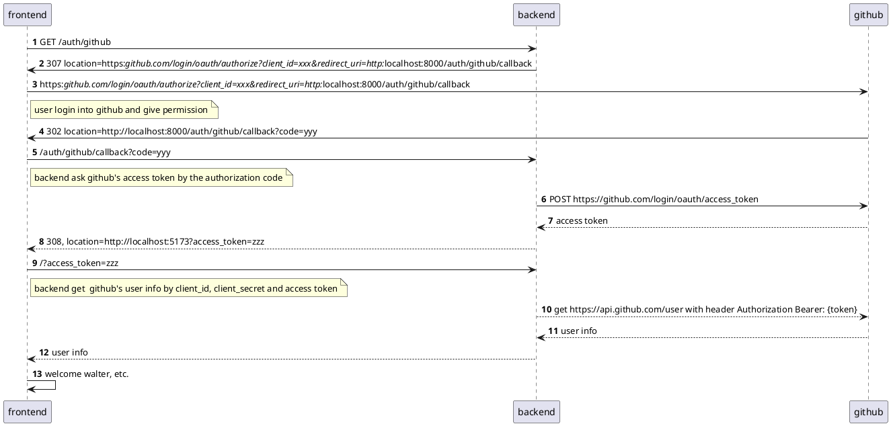

##

## prepare

1. 在 GitHub 创建 OAuth App
登录 GitHub 后，访问 Settings -> Developer settings -> OAuth Apps

点击 "New OAuth App"

填写信息：

Application name: 你的应用名称

Homepage URL: http://localhost:8081 (Vue.js 开发服务器)

Authorization callback URL: http://localhost:8081/callback (或你的后端回调端点)

注册后，记下 Client ID 和生成一个 Client Secret

2. write backend by fastapi

3. write frontend by vue

   

## backend flow

